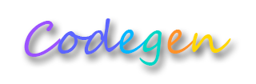

## Codegen



<p align="left">
  <a href="https://openjdk.org/projects/jdk/17">
    
  </a>

  <a href="https://spring.io/projects/spring-framework">
    
  </a>

  <a href="https://openjfx.io">
    
  </a>

  <a href="https://mybatis.org/mybatis-3">
    
  </a>

  <a href="https://baomidou.com">
    
  </a>

  <a href="https://www.mysql.com">
    
  </a>

  <a href="https://www.sqlite.org">
    
  </a>

  <a href="http://www.apache.org/licenses/LICENSE-2.0">
    
  </a>
</p>

<br/>

### Introduction
LoongStudio Codegen is based on the Mybatis an open source Restful API CodeGen.

Learn more about Codegen at [https://loongstudio.github.io/docs/](https://loongstudio.github.io/docs/)

[中文说明/Chinese Documentation](README_CN.md)

### Features

* concise operation interface
* Dynamic data source switching
* Easy to use template management
* Convenient tree view search operation
* Quickly generate restful API template code
* Support for multiple data sources, include mysql, sqlite...


### Development

1. Fork main branch
2. Use IDE open the project
3. Modify and adding VM Option
```shell
--module-path "D:\Program Files\Java\javafx-sdk-18.0.1\lib" --add-modules=javafx.controls,javafx.fxml
```

4. Start the project, enjoy yourself

### Install

Download the binaries released for the operating system and install them


### Page

##### Home


##### Template


##### Connection


### License

LoongStudio Codegen is under the Apache 2.0 license. See the [Apache License 2.0](http://www.apache.org/licenses/LICENSE-2.0) file for details.
